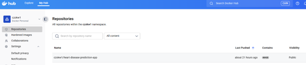
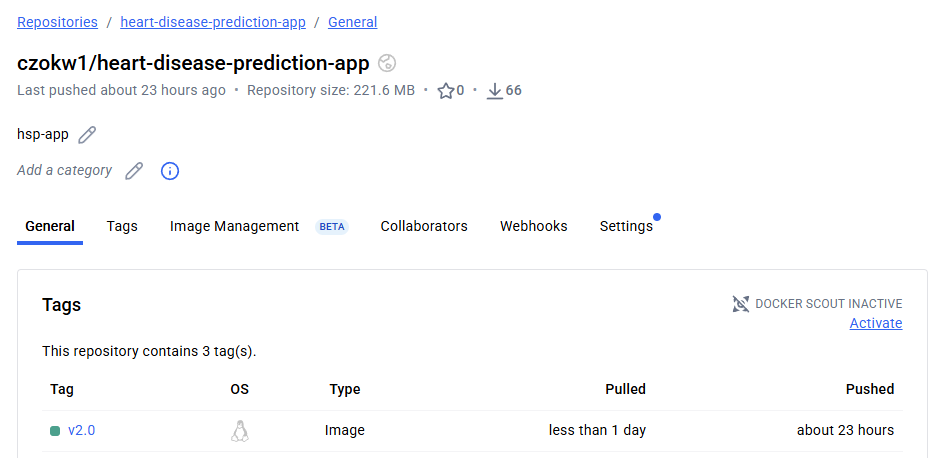
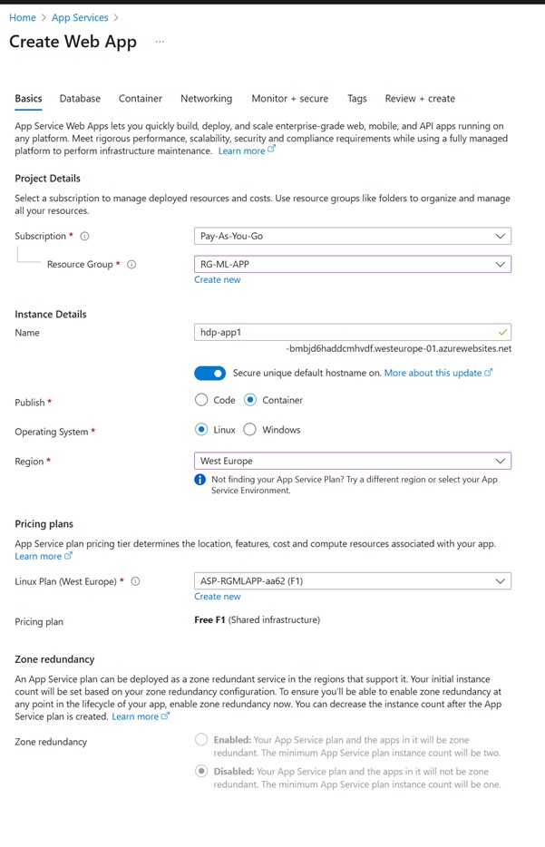
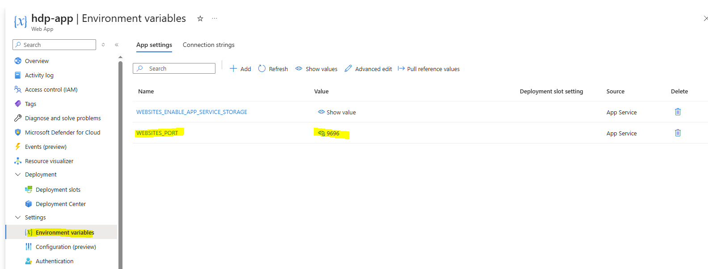
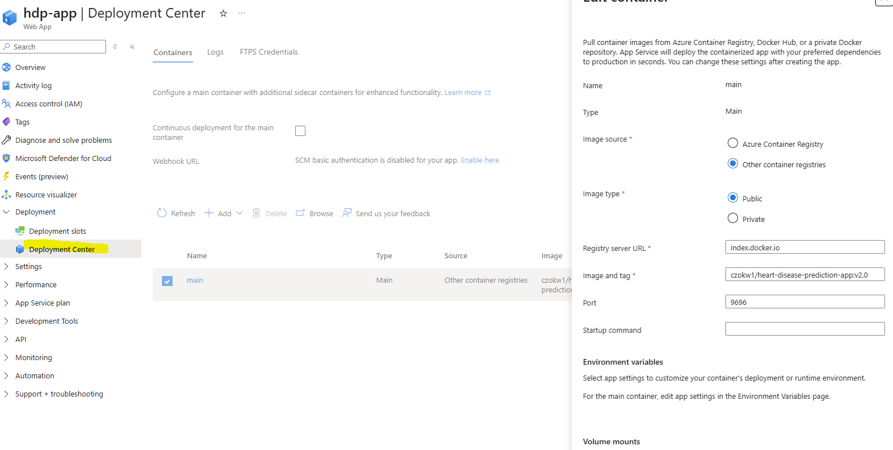
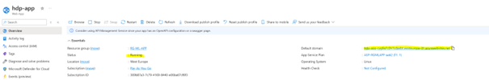
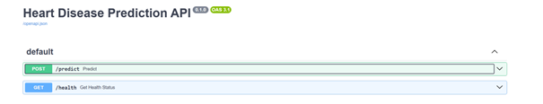
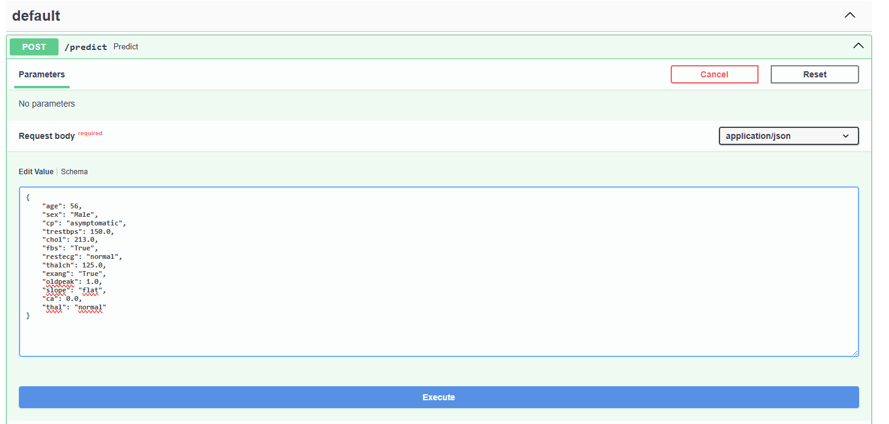
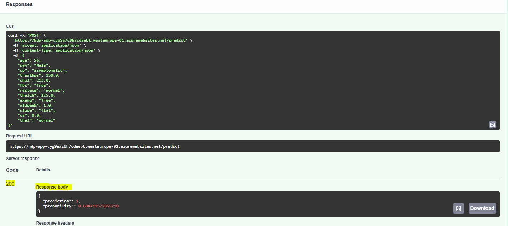

# 📄 Deployment Guide: Docker to Azure Web App

This guide outlines the steps to deploy a Dockerized application, pushed to Docker Hub, onto an Azure Web App.

---

## 1. Push Your Docker Image to Docker Hub 🐳

This section covers preparing your application and pushing its image to Docker Hub.

### 1.1 Prerequisites

Before you begin, ensure you have the following:

* Docker installed.
* A Docker Hub account.
* Logged in via the command line:

```bash
docker login
```

You'll be prompted for your Docker Hub username and password (or access token).

---

### 1.2 Create a Repository

1. Go to the Docker Hub website: [https://hub.docker.com/](https://hub.docker.com/).
2. Log in with your Docker Hub account.
3. Click **Create Repository** in the top-right corner.
4. Fill in the details:

   * **Repository name:** e.g., `heart-disease-prediction-app`
   * **Visibility:** Choose Public (free) or Private (paid)
   * **Description:** Optional
5. Click **Create**. Your repository URL will look like:
   `https://hub.docker.com/r/<your-username>/heart-disease-prediction-app`

   Example:
   `https://hub.docker.com/r/czokw1/heart-disease-prediction-app`

   
---

### 1.3 Build, Tag, and Push the Image

#### Build Image

Navigate to the directory containing your `Dockerfile`, then build your image:

```bash
docker build -t heart-disease-prediction-app:v2.0 .
```

#### Tag Image

Docker Hub requires the image to be tagged with your Docker Hub username and repository name:

```bash
docker tag heart-disease-prediction-app:v2.0 czokw1/heart-disease-prediction-app:v2.0
```

#### Push Image

Push the image to your repository:

```bash
docker push czokw1/heart-disease-prediction-app:v2.0
```

**Verify:** Check your repository directly at [https://hub.docker.com/repositories](https://hub.docker.com/repositories).



---

## 2. Deploy to Azure Web App ☁️

This section covers setting up the application on Azure App Services.

### Create Web App

1. Go to **App Services** and create a **Web App**.
2. **Basics Configuration:**

   * Fill in standard fields like **Resource Group** and **Instance Name**
   * Set **Publish** to **Container** and **Operating System** to **Linux**
   * Select a **Region** nearest to your location
   * Configure the **Pricing plan** (e.g., Free F1 plan)



### Container Configuration

1. Skip the Database section.
2. In the **Container** section:

   * Select **Image source** as **Other container registers**
   * Leave the name as `main` and the **Registry server URL** as default
   * In the Docker Hub option, leave **Access Type** as public
   * In **Image and tag**, fill in the path to your image, e.g.,
     `czokw1/heart-disease-prediction-app:v2.0`
   * Set the **Port**, e.g., `9696`
   * Leave the **Startup command** blank (Dockerfile CMD will be used)

### Review and Create

* Leave **Networking** and **Monitor + secure** at their default settings
* Click **Review and create**

### Set Environment Variable

Add an environment variable:

* **Key:** `WEBSITES_PORT`
* **Value:** `9696`



### Deployment Center

To check current app set up please go to the deployment center and click on container name then you will see the container details


---

## 3. Verify Deployment ✅

* Check the app's **Overview** screen to confirm the **Status** is **Running**

   

* Test the default domain address (e.g., by navigating to the `/docs` endpoint)

   

* To test created 'predict' method click on it and drill to details then click on 'Try it out'. Please provide in the json format patient details and click 'Execute'.
   
* If data is provided in the proper format you will get response 200 and prediction output.

   

* App URL : https://hdp-app-cyg9a7c0h7cdaebt.westeurope-01.azurewebsites.net/docs

* Input data format:
```
   {
      "age": 56,
      "sex": "Male",
      "cp": "asymptomatic",
      "trestbps": 150.0,
      "chol": 213.0,
      "fbs": "True",
      "restecg": "normal",
      "thalch": 125.0,
      "exang": "True",
      "oldpeak": 1.0,
      "slope": "flat",
      "ca": 0.0,
      "thal": "normal"
   }
```